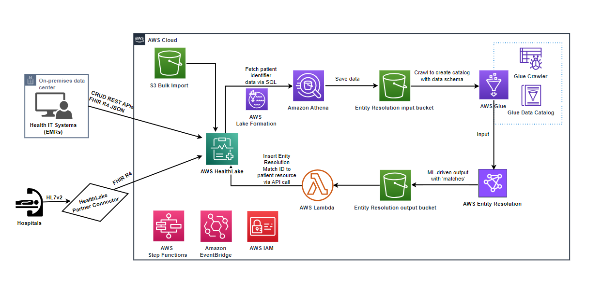
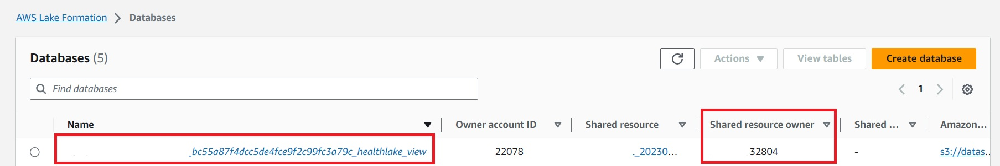
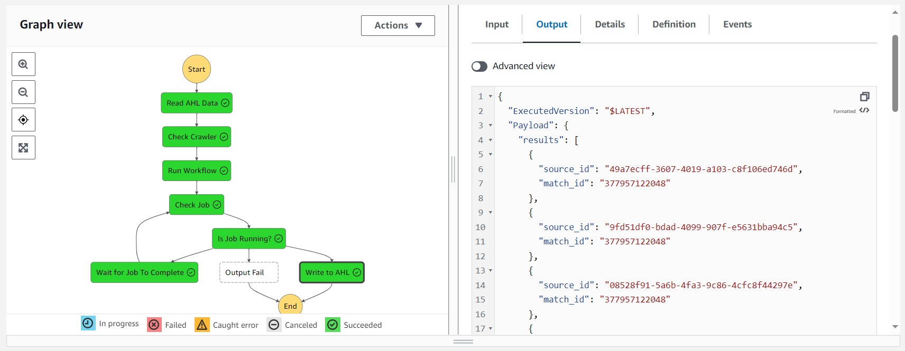
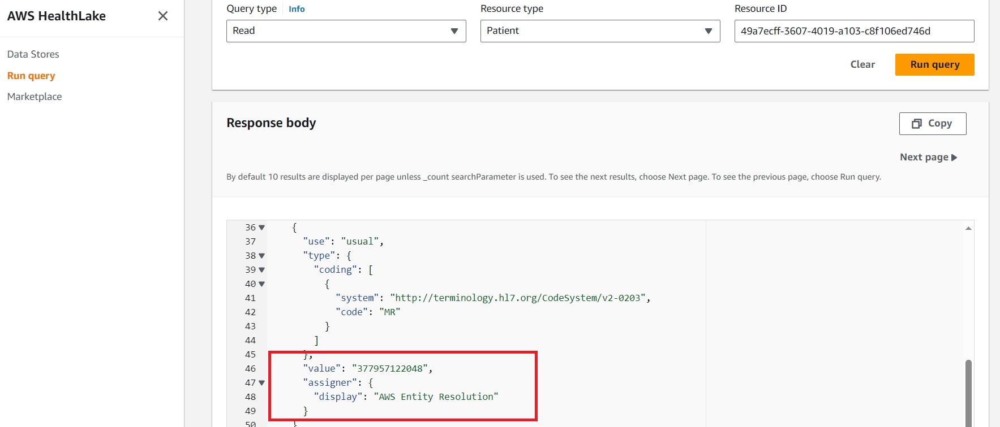

## AWS HealthLake Patient Entity Resolution with AWS Entity Resolution Service

This project leverages [AWS Entity Resolution](https://aws.amazon.com/entity-resolution/) service to perform entity resolution for patient resources stored in [AWS HealthLake (AHL)](https://aws.amazon.com/healthlake/) data store. The implementation of entity resolution within AHL serves as a critical foundational element ensuring data integrity across the data store. An "entity" in this context can denote a singular patient, provider, organization, or healthcare facility. Entity resolution is the pivotal process of determining whether multiple records within AHL pertain to the same real-world object, such as a patient or provider. For example, our healthcare customers have told us that they are challenged by matching patients across data sources that originate from multiple internal systems or even multiple organizations. 

Using the AWS Entity Resolution service, this project addresses this challenge by employing machine learning-based matching algorithm to accurately identify and link disparate patient records, enhancing AHL's ability to establish comprehensive patient profiles with confidence scores, thus ensuring accurate and cohesive healthcare data management. This process is one of the required steps in the broader processes known as Master Data Management (MDM), or Enterprise Master Patient Index (EMPI).

### Architecture

The following diagram describes the architecture of this patient entity resolution solution, which leverages AWS native services that align with the [AWS Well-Architected Framework](https://aws.amazon.com/architecture/well-architected/), ensuring robust architecture across key dimensions, such as security, reliability, performance efficiency, and cost optimization.

This solution includes the following high-level steps and AWS native services:

* Fetch patient identifier information out of the AHL data store using Amazon Athena SQL query. 

The [Amazon Athena](https://aws.amazon.com/athena/) query runs against the [AWS Lake Formation](https://aws.amazon.com/lake-formation/) resource link database, which is automatically created inside a HealthLake service account. The query result dataset is saved in a S3 bucket as a CSV file. The identifier attributes of the patient resources used for query could include attributes like name, address, phone number, date of birth, and gender. 

* Present the patient dataset to AWS Entity Resolution. 

Once the patient dataset has been created in the previous step, we will use an [AWS Glue Crawler](https://docs.aws.amazon.com/glue/latest/dg/add-crawler.html) to crawl the dataset and populate an [AWS Glue Data Catalog](https://docs.aws.amazon.com/glue/latest/dg/catalog-and-crawler.html) table. This table will then be ready for ingestion into the AWS Entity Resolution service. 

* Generate ML-driven matches with AWS Entity Resolution.

An Entity Resolution schema mapping and a matching workflow have been created in this solution to define how to match the input patient data and where to write the match results. By default, this solution uses the pre-configured [machine learning-based matching](https://docs.aws.amazon.com/entityresolution/latest/userguide/glossary.html#ml-matching-defn) technique to find matches across the input patient dataset. A Lambda function triggers a job of the matching workflow and writes the results, with Entity Resolution match ID and confidence level, to another S3 bucket. You can also use the [rule-based matching](https://docs.aws.amazon.com/entityresolution/latest/userguide/glossary.html#rule-based-matching-defn) technique in the matching workflow to define your own matching rules and find exact matches that meet your entity resolution requirements.  

* Insert Entity Resolution match-IDs into the AHL patient resources.

Once AWS Entity Resolution has identified matching patient records, the solution will use a Lambda function to read and parse the Entity Resolution results, and insert the match-IDs with a pre-defined high confidence level back into the patient resources as new identifier attributes. This will allow you to easily identify and link matching patient records across your AHL data store. 

### Deployment

To implement this solution, you can deploy this [AWS CloudFormation template](./ahl-aer-template.json). 
Before deploying this template, you will need the following information to use as input parameters to the template:

* The data store ID of a HealthlLake data store that you want to use for patient entity resolution. 
* The database name and the shared resource owner ID (or catalog ID) of the AWS LakeFormation database that is linked to the AWS HealthLake data store.

The output of this template includes an [AWS Step Function](https://aws.amazon.com/step-functions/) state machine, such as `ahl-entity-resolution-state-machine`. You can execute this state machine on demand to run the solution and perform patient entity resolution for your AHL data store. This template also creates an [AWS EventBridge Scheduler](https://docs.aws.amazon.com/eventbridge/latest/userguide/scheduler.html) to automatically trigger the state machine regularly, such as every night at 10 o’clock. You can modify the schedule of this scheduler to run the solution based on your business needs. 

We also include the python source codes for all the Lambda functions orchestrated by the state machine in the [lambda](lambda/) folder of this repo.

### Verify Results

To check the matched patient records identified by this solution, you can either:

* Go to the [AWS CloudWatch Log Group](https://docs.aws.amazon.com/AmazonCloudWatch/latest/logs/Working-with-log-groups-and-streams.html) linked to the Step Function. The log group contains detailed information about the execution of the Step Function, including the input and output of each step.
* Go to the Execution page of the Step Function and check the Output of the last step of the state machine. The last step of the state machine generates the match results, which include the matched patient resource IDs (as `source_id`) and the `match_id` returned by the Entity Resolution service.

Once you have identified the patient resource IDs from the AWS Entity Resolution matching output, you can go to the AHL data store to query the patient resource by using patient resource IDs identified above. You will be able to see that a new identifier attribute is created for the patient from AWS Entity Resolution with the match_id showing as the identifier attribute value.

The match ID returned from AWS Entity Resolution will remain the same for a source patient record across multiple workflow runs, unless you change the matching workflow configuration or the patient record is significantly updated.

This solution provides a baseline for your patient entity resolution solution in HealthLake.  It is a flexible and extensible framework that you can use to build your own applications and workloads on top of it. You can enhance or modify the solution to meet your specific healthcare entity resolution requirements.

## Contributing

Contributions are more than welcome. Please read the [code of conduct](CODE_OF_CONDUCT.md) and the [contributing guidelines](CONTRIBUTING.md).

## License Summary

This sample code is made available under a modified MIT license. See the LICENSE file.

